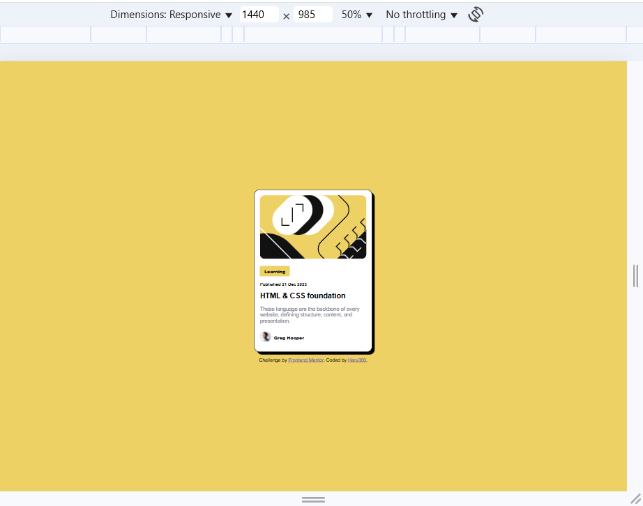
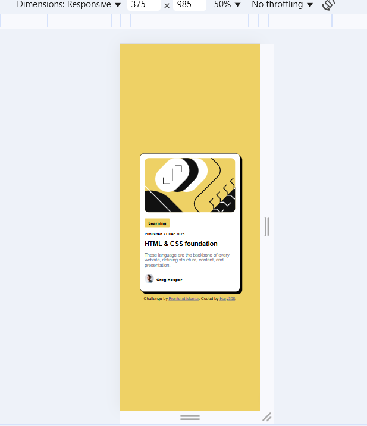

# Frontend Mentor - Blog preview card

This is a solution to the [Blog preview card challenge on Frontend Mentor](https://www.frontendmentor.io/challenges/blog-preview-card-ckPaj01IcS).

## Table of contents

- [Overview](#overview)
  - [Screenshot](#screenshot)
  - [Links](#links)
- [My process](#my-process)
  - [Built with](#built-with)
  - [What I learned](#what-i-learned)

## Overview

### Screenshot

### Links

- Solution URL: [Add solution URL here](https://github.com/Hary300/Blog-preview-card)
- Live Site URL: [Add live site URL here](https://hary300.github.io/Blog-preview-card/)

## My process

### Built with

- Semantic HTML5 markup
- CSS custom properties
- Flexbox

### What I learned

# Front-end Style Guide

## Layout

The designs were created to the following widths:

- Mobile: 375px
- Desktop: 1440px

## Colors

- Yellow: hsl(47, 88%, 63%)

- White: hsl(0, 0%, 100%)

- Gray 500: hsl(0, 0%, 42%)
- Gray 950: hsl(0, 0%, 7%)

## Typography

### Body Copy

- Font size (paragraph): 16px

### Font

- Family: [Figtree](https://fonts.google.com/specimen/Figtree)
- Weights: 500, 800
